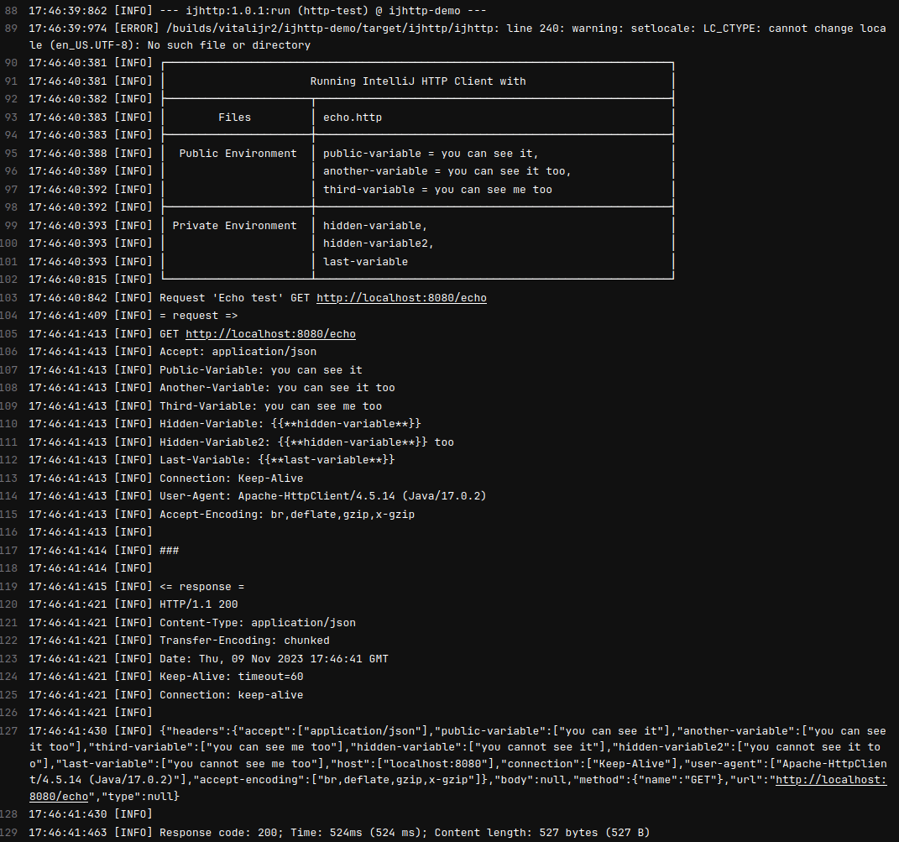

# IntelliJ HTTP Client Demo

This is a demo project to show using of [IntelliJ HTTP Client][ijhttp] CLI.
Further reading about [HTTP Client][http-client].

## How to run IntelliJ HTTP Client

There are two options: run it with `exec-maven-plugin` and `ijhttp-maven-plugin`.
Both require to install or download **IntelliJ HTTP Client CLI**.
I use `download-maven-plugin` to download it.

### … with `exec-maven-plugin`

```bash
./mvnw -Pdownload-ijhttp,spring-boot,exec
```

### … with `ijhttp-maven-plugin`

```bash
./mvnw -Pdownload-ijhttp,spring-boot,maven-plugin
```

## Using with GitLab CI

There is `.gitlab-ci.yml` who downloads and unpacks `ijhttp` them runs it.

```yaml
http-test:
  stage: test
  script:
    - microdnf install unzip
    - curl -f -s -L -o ijhttp.zip https://jb.gg/ijhttp/latest
    - unzip -nq ijhttp.zip -d target
    - rm ijhttp.zip
    - mvn $MAVEN_CLI_OPTS verify -Pspring-boot,maven-plugin
```

Example:


[ijhttp]: https://www.jetbrains.com/help/idea/http-client-cli.html "HTTP Client CLI"

[http-client]: https://www.jetbrains.com/help/idea/http-client-in-product-code-editor.html "HTTP Client"

